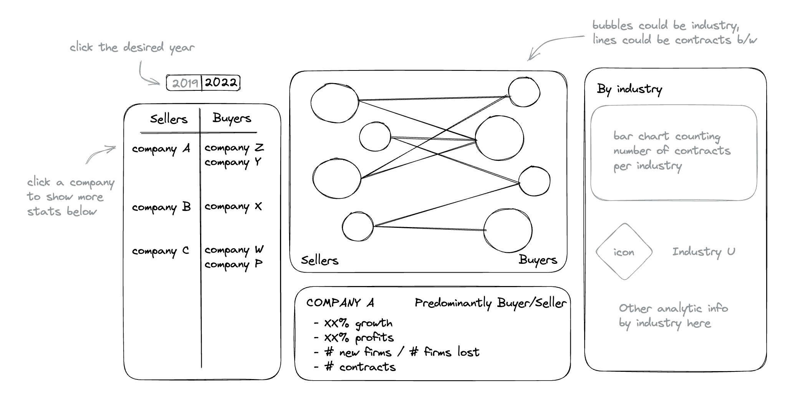

# Research Proposal: How the Pandemic Impacted the Supply Chain
By Kyra Grodman, Jersey Krupp, and Qiyu Yang

## Research Question
We want to explore how the supply chain network has reformed and changed following the pandemic based on customer/supplier contracts from SEC filings. Our initial hypothesis is that the amount of technology based companies will increase as the number of sellers does. Another hypothesis we have is that the amount of contracts involving healthcare/pharmaceutical companies will also increase. Moreover, we hypothesize that there are more new firms in healthcare and technology in comparison to 2019. Overall, we want to compare the number of contracts as well as compare the growth of technology companies within the supply chain network.

## Necessary Data
1. The final dataset will include:
      1. SEC contracts from 2019 and 2022
      2. Observations that are firm level and firm-pair networks (firm A sells to firm B, etc.)
      3. A sample period of 2019 & 2022
      4. A sample conditions of 2019 & 2022 
      5. We will start looking at SP 500 companies, technology companies, big supply chain companies (Walmart, Target, etc.).   
      6. We will obtain accounting statistics of the companies, to determine the financial health of the company
2. We will need the 10E & 10K for each company
3. We may need to collect more data based on the information we currently have.
4. Raw inputs: the names of buyers and sellers in 2019 & 2022
    1. Will store the 10E & 10K based on code provided by Dr. Bowen
    2. Will store the scraped data in the according dataframes
5. Transforming the raw data into the final form
    1. Figure out which companies to look at
    2. Use URLs/code from Midterm to obtain the buyers/seller names
    3. Add these to a dataframe
    4. Analyze the results
    5. Convert results into a dashbaord using the dashboard chapter in the textbook and the accompanying resource such as streamlit to show the outputs made in python
    
**Sample Dashboard**

